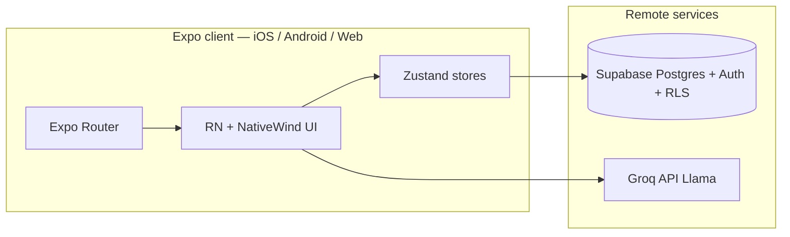
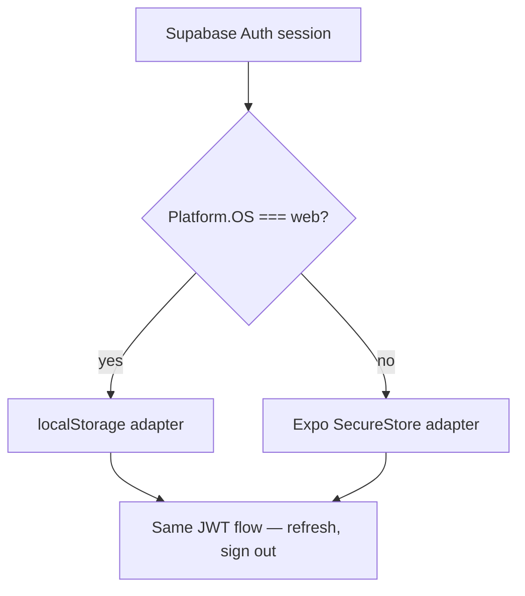
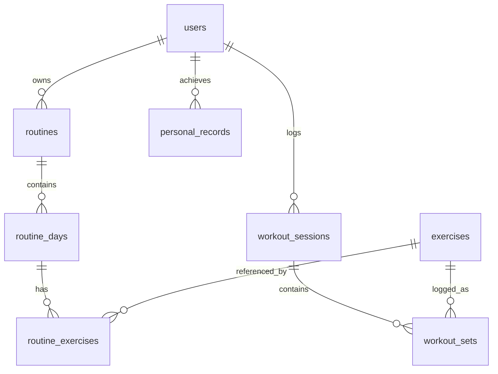
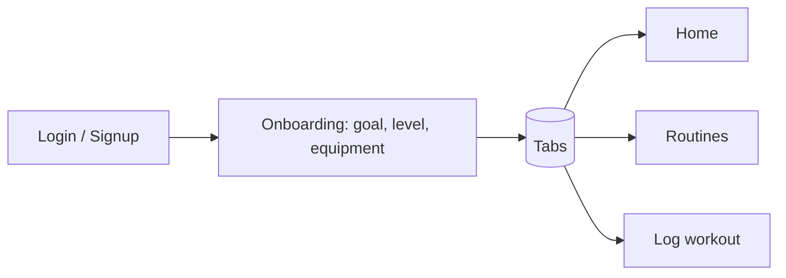
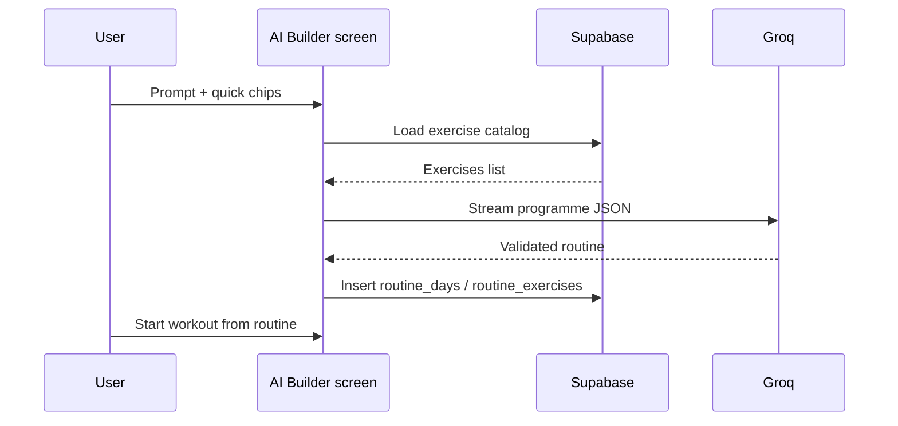
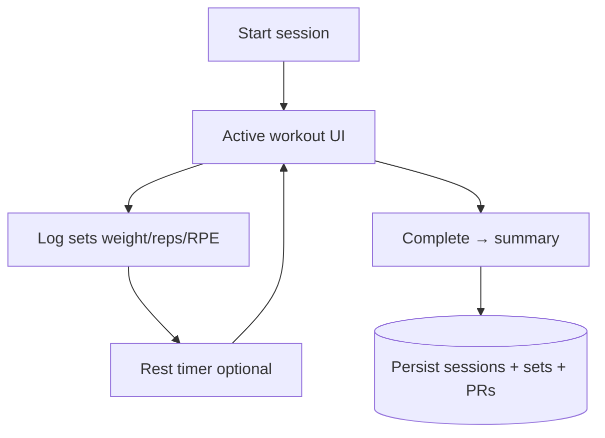

# SuperReps

**AI-first workout tracking** — describe your goals in plain language, get structured programmes from your exercise library, log sets in the gym, and review progress. One [Expo](https://expo.dev) codebase runs on **iOS**, **Android**, and **web** (React Native Web + static export).

---

## Purpose

SuperReps inverts the usual “search every exercise manually” flow:

| Traditional apps | SuperReps |
|------------------|-----------|
| Build routines exercise-by-exercise | **Natural-language prompts** → full split / week structure |
| Static templates only | **Groq (Llama)** generates JSON matched to **your** seeded exercise slugs |
| Separate web vs mobile products | **Single repo**: Expo Router + shared stores and API clients |

Product vision, personas, and roadmap live in [`docs/SuperReps_PRD.md`](docs/SuperReps_PRD.md). Wireframes: [`docs/SuperReps_User_Flow_Wireframes.md`](docs/SuperReps_User_Flow_Wireframes.md).

> **Note:** [`docs/SuperReps_Technical_Diagrams.md`](docs/SuperReps_Technical_Diagrams.md) describes an *aspirational* architecture (e.g. Flutter, MongoDB, vector DB). **This repository** is implemented with **Expo, Supabase (Postgres), and Groq** — the diagrams and ER below match *this* code.

---

## Tech stack

| Layer | Choice |
|-------|--------|
| **App framework** | Expo SDK ~54, React 19, React Native 0.81 |
| **Navigation** | Expo Router (file-based routes, typed routes) |
| **Styling** | [NativeWind](https://www.nativewind.dev/) v4 + Tailwind CSS 3 (`className` on RN primitives) |
| **State** | [Zustand](https://github.com/pmndrs/zustand) (`stores/`) |
| **Forms / validation** | react-hook-form, Zod |
| **Backend & auth** | [Supabase](https://supabase.com) — Postgres, Auth, Row Level Security |
| **AI** | [Groq](https://groq.com) SDK — streaming JSON routines + in-workout coach copy |
| **Charts** | victory-native |
| **Web** | `react-native-web`, Metro bundler, **static** export (`expo export -p web`) |
| **Deploy (web)** | [Vercel](https://vercel.com) — `dist/` output (see `vercel.json`) |
| **Language** | TypeScript |

Environment variables and database bootstrap: **[`SETUP.md`](SETUP.md)** (copy `.env.example` → `.env`).

---

## Architecture (this repo)

High-level: the client is a **thick SPA / native shell**. All durable data goes **through Supabase’s HTTP API** with the **anon** key and RLS; AI calls go **directly from the client** to Groq using `EXPO_PUBLIC_GROQ_API_KEY` (see security note below).



### Auth persistence (web vs native)



Implementation: [`lib/supabase.ts`](lib/supabase.ts).

### AI pipeline

- **Routine generation**: `llama-3.3-70b-versatile` — streamed JSON, validated with **Zod** against allowed exercise slugs from Supabase.
- **Coach tips** (during a set): `llama-3.1-8b-instant` — short streaming text.
- **Weekly review** (optional): markdown-style summary from session summaries.

Source: [`lib/ai.ts`](lib/ai.ts).

### Data model (Supabase)

Simplified entity relationships (full SQL: [`supabase/schema.sql`](supabase/schema.sql)):



---

## How the app is organized

File-based routing under `app/`:

```text
app/
├── _layout.tsx              # Root: auth listener, GestureHandlerRootView, Stack
├── (auth)/                  # Login, signup, onboarding (goal → level → equipment)
├── (tabs)/                  # Main shell: Home, Routines, Log, Progress, Profile
├── routines/                # Routine detail, AI builder screen
└── workout/                 # Active session + completion summary
```

- **Unauthenticated users** are redirected to `/(auth)/login` from the tabs layout ([`app/(tabs)/_layout.tsx`](app/(tabs)/_layout.tsx)).
- **Root layout** subscribes to `supabase.auth` and hydrates [`stores/userStore.ts`](stores/userStore.ts).

---

## User flows (simplified)

### Onboarding → main app



### AI routine → save → workout



### Workout logging



---

## UI layer (components and design)

There is no large separate `components/` package in this tree yet; **screens are composed in `app/**`** using:

| Building block | Role |
|----------------|------|
| **React Native primitives** | `View`, `Text`, `ScrollView`, `TouchableOpacity`, `FlatList`, etc. |
| **NativeWind** | Utility classes, e.g. `className="flex-1 bg-surface"` on RN views |
| **Theme tokens** | Tailwind `brand` / `surface` in [`tailwind.config.js`](tailwind.config.js); imperative colors in [`constants/index.ts`](constants/index.ts) (`COLORS`) for tab bar, icons, etc. |
| **@expo/vector-icons** | `Ionicons` for tabs and actions |
| **Victory Native** | Progress / charts on the Progress tab |

**Visual direction:** dark UI (`#0F172A` surface, `#1E293B` cards, `#3B82F6` primary accent), portrait-first (`app.json`).

---

## Running the project

Prerequisites: **Node ≥ 20**, npm, and accounts/keys for Supabase + Groq ([`SETUP.md`](SETUP.md)).

```bash
npm install
npm start
```

From the Expo dev UI you can open:

| Goal | Command / action |
|------|-------------------|
| **Dev server (all platforms)** | `npm start` — then `i` / `a` / `w` or scan QR |
| **Web only (dev)** | `npm run web` → `expo start --web` |
| **iOS simulator** | `npm run ios` |
| **Android emulator** | `npm run android` |
| **Static web build** | `npm run build:web` → output for hosting |
| **Preview static build locally** | `npm run build:web` then `npm run preview:web` (`expo serve`) |
| **Production deploy (Vercel)** | `vercel link` → `npm run sync:vercel-env` → `npm run deploy` |

Database: run `supabase/schema.sql` then `supabase/seed_exercises.sql` in the Supabase SQL editor, **or** `npm run db:setup` with `DATABASE_URL` locally (see SETUP).

---

## How **web** works

1. **Same JavaScript bundle** as mobile, compiled with **Metro**; native views map to DOM via **react-native-web**.
2. **`app.json`** sets `"web": { "bundler": "metro", "output": "static" }` — production is a **static site** (no Node server in Vercel for the app itself).
3. **Auth** uses `localStorage` (and an in-memory fallback during static export SSR where `window` is absent).
4. **Hosting:** Vercel runs `npm ci` + `npm run build:web` and serves the **`dist/`** folder.

---

## How **mobile** works (today and next steps)

| Mode | What happens |
|------|----------------|
| **Expo Go (dev)** | Scan QR from `npm start`; fastest way to share with testers — no App Store build. |
| **Production builds** | Use [EAS Build](https://docs.expo.dev/build/introduction/) (example commands in [`SETUP.md`](SETUP.md)): `eas build` for store-ready or “preview” binaries with your bundle IDs (`com.superreps.app`). |
| **Auth** | Sessions persisted in **Expo SecureStore** (encrypted OS storage). |
| **Deep linking** | App scheme `superreps` in `app.json` for future universal links. |

The **feature set is the same** on web and mobile; platform differences are mostly storage, safe areas, and optional haptics (`expo-haptics`).

---

## Security note (Groq from the browser)

The Groq client is configured for browser use (`dangerouslyAllowBrowser: true` in [`lib/ai.ts`](lib/ai.ts)). That is convenient for development and static hosting, but **exposes the API key to anyone who can open your site**. For production hardening, prefer a **small backend or Edge function** that holds the Groq secret and proxies completions.

---

## Scripts reference

| Script | Description |
|--------|-------------|
| `npm start` | Expo dev server |
| `npm run web` | Dev server targeting web |
| `npm run build:web` | Static export to `dist/` |
| `npm run preview:web` | Serve `dist/` locally |
| `npm run deploy` | Build web + `vercel deploy --prod` |
| `npm run db:setup` | Apply SQL migrations/seed via `DATABASE_URL` |
| `npm run typecheck` | `tsc --noEmit` |

---

## Documentation map

| Doc | Contents |
|-----|----------|
| [`SETUP.md`](SETUP.md) | Env vars, Supabase setup, AI models, Vercel |
| [`docs/SuperReps_PRD.md`](docs/SuperReps_PRD.md) | Product requirements |
| [`docs/SuperReps_API_Specifications.md`](docs/SuperReps_API_Specifications.md) | API-oriented notes (if present) |
| [`docs/SuperReps_User_Flow_Wireframes.md`](docs/SuperReps_User_Flow_Wireframes.md) | UX flows |

---

## License

Private project (`"private": true` in `package.json`). Adjust this section when you publish or open-source.
