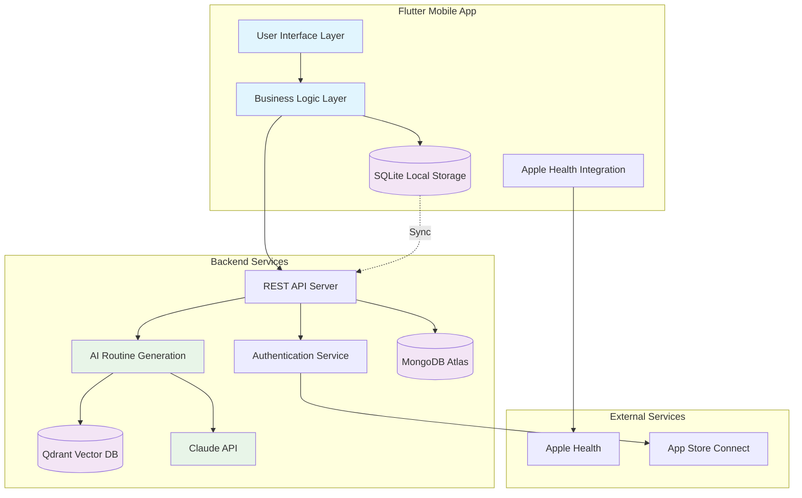
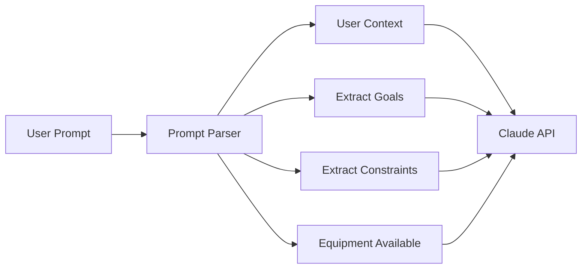
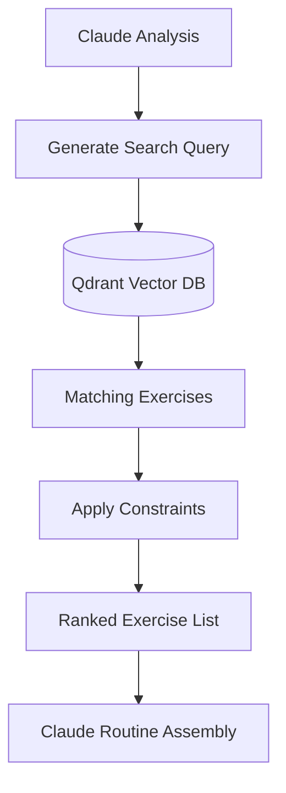
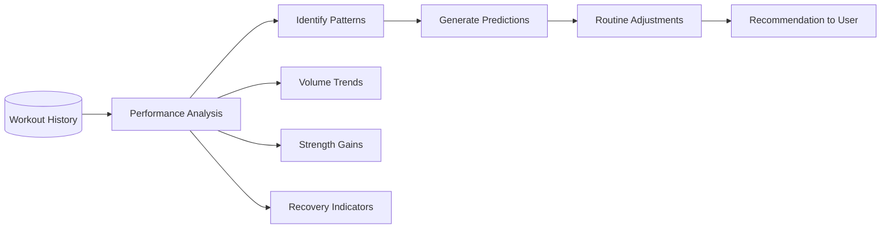

# SuperReps Product Requirements Document
*AI-First Fitness App*

**Document Version:** 1.0  
**Last Updated:** March 24, 2026  
**Author:** Product Team  

---

## Table of Contents

1. [Executive Summary](#1-executive-summary)
2. [Market Analysis & Competitive Gap](#2-market-analysis--competitive-gap)
3. [User Personas & Use Cases](#3-user-personas--use-cases)
4. [Core Features & User Stories](#4-core-features--user-stories)
5. [Technical Architecture](#5-technical-architecture)
6. [AI Implementation Strategy](#6-ai-implementation-strategy)
7. [Monetization Strategy](#7-monetization-strategy)
8. [Development Roadmap](#8-development-roadmap)

---

## 1. Executive Summary

### Vision Statement
SuperReps is an AI-first fitness app that generates complete, personalized workout programs from natural language prompts, revolutionizing how people create and follow fitness routines.

### Market Positioning
SuperReps positions itself as the intelligent alternative to manual fitness apps like Hevy by completely inverting the routine creation flow. Instead of manually searching for and adding exercises one by one, users simply describe their workout goals in plain English, and our AI generates a complete, structured program in seconds.

### Core Value Proposition
- **Speed**: Get a complete workout program in ~4 seconds vs. 15+ minutes of manual creation
- **Intelligence**: AI understands context, goals, and generates progressive programs
- **Accessibility**: No fitness knowledge required - perfect for beginners
- **Flexibility**: Easy refinement and customization of AI-generated routines

### Key Success Factors
- Superior AI routine generation quality and speed
- Seamless offline workout logging experience
- Clean, intuitive user interface focused on essentials
- Strong Apple Health integration for holistic fitness tracking

---

## 2. Market Analysis & Competitive Gap

### Current Market Leader: Hevy Analysis

#### Hevy's Limitations (Our Opportunities)

**❌ No AI Workout Generation**
- **Problem**: Users must manually search and add exercises one by one
- **Impact**: 15+ minutes to create a basic routine, overwhelming for beginners
- **SuperReps Solution**: AI generates complete programs from natural language prompts in ~4 seconds

**❌ Restrictive Free Tier (4 Routines Max)**
- **Problem**: Artificial limit creates immediate paywall friction
- **Impact**: #1 cause of user churn in first week
- **SuperReps Solution**: Unlimited routines free - monetize on AI intelligence depth instead

**❌ Limited History (3 Months Free)**
- **Problem**: Progress tracking severely limited on free tier
- **Impact**: Users lose long-term motivation and data
- **SuperReps Solution**: 12 months history free, unlimited on Pro

**❌ No Periodization Intelligence**
- **Problem**: Static routines with no adaptive progression
- **Impact**: Plateaus and lack of continuous improvement
- **SuperReps Solution**: AI auto-adjusts progressive overload week-over-week based on performance

#### What Hevy Does Well (We'll Retain)
- ✅ **Clean Exercise Logging UX**: Intuitive set/rep entry and rest timer
- ✅ **Set Types**: Warmup, drop sets, failure sets for advanced training
- ✅ **Apple Health Integration**: Seamless workout data sync
- ✅ **Offline Capability**: Works in gyms with poor connectivity

### Market Size & Opportunity
- **Total Addressable Market**: 2.8B smartphone users interested in fitness
- **Serviceable Addressable Market**: 280M fitness app users globally
- **Serviceable Obtainable Market**: 28M users frustrated with manual routine creation
- **Initial Target**: 100K active users within 12 months

### Competitive Landscape
| App | Strength | Weakness | SuperReps Advantage |
|-----|----------|----------|-------------------|
| Hevy | Clean UX, reliable | Manual creation, limited free tier | AI generation, unlimited free routines |
| Strong | Social features | Complex interface | Focus on individual experience |
| Jefit | Exercise database | Overwhelming UI | AI simplifies exercise selection |
| Apple Fitness+ | High production value | Requires subscription, limited customization | Free AI customization |

---

## 3. User Personas & Use Cases

### Primary Persona: Alex - Gym Beginner-Intermediate (70% of users)

**Demographics:**
- Age: 22-35
- Experience: 6 months - 2 years lifting
- Goals: Build muscle, improve strength, look better
- Pain Points: Doesn't know what exercises to do, paralyzed by choice

**Needs:**
- Simple workout program creation
- Guidance on exercise selection and progression
- Motivation through visible progress tracking
- Confidence that they're following an effective routine

**User Journey:**
1. "I want to build muscle but don't know where to start"
2. Downloads SuperReps, enters goals in onboarding
3. Types "beginner muscle building routine" in chat
4. Receives complete 4-day split in seconds
5. Starts first workout, loves the guided experience
6. Becomes daily active user tracking all workouts

### Secondary Persona: Sam - Experienced Lifter (25% of users)

**Demographics:**
- Age: 25-45
- Experience: 3+ years consistent training
- Goals: Specific strength/physique targets, optimize training
- Pain Points: Wants advanced features without complexity

**Needs:**
- Fast workout logging during training
- Advanced analytics and progress tracking
- Customizable routines with periodization
- Integration with health data for holistic view

**User Journey:**
1. Frustrated with current app's limitations
2. Tries SuperReps for AI routine generation
3. Discovers superior analytics and progression features
4. Migrates all historical data
5. Becomes power user and advocate

### Tertiary Persona: Jordan - PT/Coach (5% of users, v2 scope)

**Demographics:**
- Age: 25-40
- Role: Personal trainer, online coach
- Goals: Manage client programs efficiently
- Pain Points: Time-consuming program creation for multiple clients

**Needs (Future):**
- Bulk routine generation for clients
- Client progress monitoring dashboard
- Customizable program templates
- Export capabilities for client sharing

---

## 4. Core Features & User Stories

### 4.1 AI Routine Generation

#### Core User Stories
- **As a beginner**, I want to describe my goals in plain English so that I can get a complete workout program without needing fitness knowledge
- **As a busy person**, I want to generate a routine in seconds so that I don't waste time researching exercises
- **As someone with specific needs**, I want to specify equipment/time constraints so that my routine fits my situation

#### Feature Requirements
- **Chat Interface**: Clean prompt bar with suggestion chips for common requests
- **Contextual AI**: Considers user profile (experience, goals, equipment access, time availability)
- **Streaming Response**: Shows routine building in real-time for perceived speed
- **Refinement Options**: Easy editing of generated routines (swap exercises, adjust sets/reps)
- **Save & Organize**: Categorize routines by goal (strength, hypertrophy, endurance)

#### Example Prompts & Responses
```
User: "chest and triceps workout for intermediate"
AI: Generates 6-exercise routine with compound and isolation movements, 
    appropriate rep ranges, and rest periods

User: "full body routine, only dumbbells, 45 minutes"
AI: Generates time-efficient routine using only dumbbell exercises
    with superset recommendations to fit time constraint
```

### 4.2 Workout Logging (Hevy-Style Excellence)

#### Core User Stories
- **As a gym-goer**, I want to log sets quickly between exercises so that I don't waste rest time
- **As someone in a basement gym**, I want offline logging so that poor cell service doesn't interrupt my workout
- **As a detail-oriented lifter**, I want to track different set types so that I can analyze my training patterns

#### Feature Requirements
- **Quick Set Entry**: Large, thumb-friendly weight/rep inputs
- **Rest Timer**: Customizable intervals with audio/haptic alerts
- **Set Types**: Visual indicators for warmup, working sets, drop sets, failure sets
- **Exercise Notes**: Quick voice or text notes for form cues or observations
- **Offline First**: All logging works without internet, syncs when available
- **Apple Health Write**: Automatically creates HKWorkout entries on session completion

### 4.3 Progress Analytics (Heavy-Style Analysis)

#### Core User Stories
- **As a data-driven lifter**, I want to see strength progression charts so that I can track improvement over time
- **As someone building habits**, I want achievement badges so that I stay motivated to be consistent
- **As a goal-oriented person**, I want progress predictions so that I can see when I'll hit my targets

#### Feature Requirements
- **Volume Tracking**: Total weight moved, sets completed, workout frequency
- **Strength Progression**: 1RM estimates, personal records, progression curves
- **Body Composition**: Integration with smart scales, progress photos
- **Achievement System**: Consistency streaks, milestone badges, personal records
- **Comparative Analytics**: Progress vs. similar users (anonymized)
- **Export Capability**: CSV export for external analysis

### 4.4 Health Integration

#### Core User Stories
- **As a Health app user**, I want my workouts automatically logged so that I have a complete fitness picture
- **As someone tracking body weight**, I want my scale data in my workout app so that I can correlate progress
- **As a holistic health tracker**, I want two-way sync so that all my apps stay updated

#### Feature Requirements
- **Workout Writing**: HKWorkout creation with exercise details, calories, duration
- **Body Weight Reading**: Automatic weight pulls for bodyweight exercise calculations
- **Heart Rate Integration**: Display average/max HR during workouts (if available)
- **Background Sync**: Automatic data sync without manual intervention
- **Privacy Controls**: Granular permissions for different health data types

### 4.5 Explicitly Excluded Features (v1)

#### Watch Apps
- **Rationale**: Adds significant complexity without proportional value
- **Alternative**: Excellent iPhone experience covers 95% of use cases
- **Future Consideration**: v2 feature if user demand is high

#### Social Feed
- **Rationale**: Focus on individual experience and AI differentiation
- **Alternative**: Achievement sharing through standard iOS share sheet
- **Future Consideration**: Optional community features in v3

---

## 5. Technical Architecture

### 5.1 Tech Stack Rationale

#### Frontend: Flutter
- **Why Flutter**: Single codebase for iOS/Android with native performance
- **Advantages**: Mature ecosystem, excellent health plugin support, fast development
- **Health Integration**: flutter_health_kit for Apple Health, health_connect for Android
- **Offline Storage**: sqflite for local workout data with sync capabilities

#### Backend Database: MongoDB Atlas
- **Why MongoDB**: Document-based structure perfect for flexible workout data
- **User Data**: Profiles, preferences, subscription status, workout history
- **Exercise Database**: Structured exercise data with flexible metadata
- **Scaling**: Automatic scaling and managed infrastructure
- **Authentication**: MongoDB Realm for user auth with social login support

#### Vector Database: Qdrant
- **Why Qdrant**: Open-source vector database with excellent performance
- **Exercise Similarity**: Vector embeddings for exercise recommendations
- **AI Context**: Store user preference vectors for personalized routine generation
- **Search Capability**: Semantic search for exercises based on natural language

#### AI: Claude API (Sonnet 4.0)
- **Why Claude**: Superior reasoning for complex routine generation
- **Streaming**: Real-time response streaming for perceived speed
- **Context Window**: Large context for considering user history and preferences
- **Safety**: Built-in safety filters for appropriate exercise recommendations

### 5.2 High-Level Architecture



### 5.3 Data Models

#### User Schema (MongoDB)
```json
{
  "_id": "ObjectId",
  "email": "user@example.com",
  "profile": {
    "name": "Alex Johnson",
    "experience_level": "intermediate",
    "primary_goals": ["muscle_building", "strength"],
    "available_equipment": ["barbell", "dumbbells", "machines"],
    "workout_frequency": 4,
    "session_duration": 60
  },
  "subscription": {
    "tier": "free|pro",
    "expires_at": "2026-12-31",
    "features": ["unlimited_routines", "12_month_history"]
  },
  "preferences": {
    "rest_timer_duration": 120,
    "preferred_units": "lbs",
    "notification_settings": {}
  },
  "created_at": "2026-03-24T10:00:00Z",
  "updated_at": "2026-03-24T10:00:00Z"
}
```

#### Exercise Schema (MongoDB + Qdrant Vectors)
```json
{
  "_id": "ObjectId",
  "name": "Barbell Bench Press",
  "muscle_groups": ["chest", "triceps", "front_delts"],
  "equipment": ["barbell", "bench"],
  "difficulty": "intermediate",
  "instructions": ["Lie on bench...", "Lower bar to chest..."],
  "video_url": "https://cdn.superreps.com/videos/bench_press.mp4",
  "alternatives": ["dumbbell_bench_press", "push_ups"],
  "vector_id": "qdrant_vector_id", // Links to Qdrant embedding
  "popularity_score": 0.95,
  "created_at": "2026-03-24T10:00:00Z"
}
```

#### Routine Schema (MongoDB)
```json
{
  "_id": "ObjectId",
  "user_id": "ObjectId",
  "name": "AI Upper Body Power",
  "description": "Generated routine for chest and triceps focus",
  "ai_generated": true,
  "generation_prompt": "chest and triceps workout for intermediate",
  "exercises": [
    {
      "exercise_id": "ObjectId",
      "order": 1,
      "sets": 4,
      "reps": "6-8",
      "rest_seconds": 180,
      "notes": "Focus on controlled eccentric"
    }
  ],
  "estimated_duration": 65,
  "difficulty": "intermediate",
  "created_at": "2026-03-24T10:00:00Z"
}
```

#### Workout Session Schema (MongoDB + Local SQLite)
```json
{
  "_id": "ObjectId",
  "user_id": "ObjectId",
  "routine_id": "ObjectId",
  "started_at": "2026-03-24T18:30:00Z",
  "completed_at": "2026-03-24T19:35:00Z",
  "exercises": [
    {
      "exercise_id": "ObjectId",
      "sets": [
        {
          "set_number": 1,
          "type": "warmup",
          "weight": 135,
          "reps": 12,
          "completed_at": "2026-03-24T18:35:00Z"
        }
      ]
    }
  ],
  "total_volume": 15750, // Total weight moved in lbs
  "duration_minutes": 65,
  "health_kit_workout_id": "HK_UUID",
  "synced": true
}
```

---

## 6. AI Implementation Strategy

### 6.1 Routine Generation Flow

#### Step 1: Prompt Processing


**Input Processing:**
- Natural language understanding of workout goals
- Equipment constraint extraction
- Time and frequency preferences
- Experience level consideration

#### Step 2: Exercise Selection via Vector Search


**Vector Search Process:**
- Claude generates semantic search queries for required movement patterns
- Qdrant returns exercises matching muscle group and equipment constraints
- Results filtered by user experience level and preferences
- Claude assembles exercises into coherent routine structure

#### Step 3: Routine Structuring
```json
{
  "prompt_analysis": {
    "primary_goals": ["chest_development", "tricep_strength"],
    "experience_level": "intermediate",
    "equipment": ["barbell", "dumbbells", "cable_machine"],
    "time_constraint": null,
    "frequency": "once_per_week"
  },
  "routine_structure": {
    "warmup": ["dynamic_stretches", "light_cardio"],
    "compound_movements": ["bench_press", "incline_dumbbell_press"],
    "isolation": ["tricep_dips", "cable_flyes"],
    "total_exercises": 6,
    "estimated_duration": 60
  }
}
```

### 6.2 Progressive Overload Intelligence (Pro Feature)

#### Historical Analysis
- **Volume Tracking**: Monitor total weekly volume trends
- **Strength Progression**: Track estimated 1RM improvements
- **Recovery Patterns**: Analyze performance drops indicating overreaching
- **Adherence Rates**: Factor in workout completion consistency

#### AI Recommendations


**Recommendation Types:**
- **Weight Increases**: "Ready to add 5lbs to bench press based on last 3 sessions"
- **Volume Adjustments**: "Consider adding one set to maintain progression"
- **Exercise Variations**: "Try incline bench press to target upper chest weakness"
- **Deload Suggestions**: "Performance trending down - consider 10% deload week"

### 6.3 AI Quality Assurance

#### Safety Checks
- **Exercise Compatibility**: Ensure exercise combinations make biomechanical sense
- **Volume Limits**: Prevent excessive volume recommendations for experience level
- **Progressive Overload**: Ensure recommended increases are safe and sustainable
- **Equipment Validation**: Verify all exercises match user's available equipment

#### Performance Monitoring
- **Generation Speed**: Target <4 seconds end-to-end routine generation
- **User Satisfaction**: Track routine completion rates and user ratings
- **Iteration Success**: Monitor how often users modify AI-generated routines
- **A/B Testing**: Continuously test prompt engineering improvements

---

## 7. Monetization Strategy

### 7.1 Freemium Model Shift from Quantity to Quality Gates

#### Free Tier: Remove Quantity Friction
**Philosophy**: Remove all artificial limits that block basic app usage

**Included Features:**
- ✅ **Unlimited Routine Generation**: No limit on AI-created programs
- ✅ **Unlimited Saved Routines**: Store as many programs as needed
- ✅ **12 Months Workout History**: Sufficient for meaningful progress tracking
- ✅ **Basic AI Intelligence**: Standard routine generation with good quality
- ✅ **Core Workout Logging**: Full set/rep tracking, rest timer, Apple Health sync
- ✅ **Achievement System**: Basic badges and progress celebrations

**Why This Works:**
- Eliminates #1 churn trigger (hitting routine limits)
- Users can fully evaluate the core product value
- Creates goodwill and reduces barrier to entry
- Large free user base drives word-of-mouth growth

#### Pro Tier: Advanced AI Intelligence ($9.99/month)
**Philosophy**: Monetize on AI depth and advanced insights, not basic functionality

**Pro-Only Features:**
- 🧠 **Advanced Progressive Overload AI**: Automatic weight/rep/volume adjustments based on performance analysis
- 📊 **Unlimited Workout History**: Full historical data for long-term trend analysis
- 📈 **Advanced Analytics Dashboard**: Detailed strength curves, volume analysis, body composition tracking
- 🎯 **AI Coaching Suggestions**: Mid-workout form tips, exercise substitutions, technique improvements
- 📱 **Priority AI Processing**: Faster routine generation with premium Claude API access
- 🔄 **Smart Program Periodization**: AI creates mesocycle progressions with automatic deloads
- 📧 **Weekly AI Performance Digest**: Personalized insights and recommendations via email
- 🎨 **Custom Routine Templates**: Save and share routine structures for consistent programming

### 7.2 Revenue Model Analysis

#### Target Conversion Metrics
- **Free to Pro Conversion Rate**: 8-12% (industry standard: 2-5%)
- **Monthly Churn Rate**: <5% (enabled by removing free tier friction)
- **Average Revenue Per User (ARPU)**: $2.50/month blended
- **Customer Lifetime Value (LTV)**: $65 (26-month average tenure)

#### Revenue Projections (12-Month)
```
Month 1-3:   Build to 10K MAU, 2% conversion → $200/month
Month 4-6:   Grow to 35K MAU, 5% conversion → $1,750/month  
Month 7-9:   Scale to 75K MAU, 8% conversion → $6,000/month
Month 10-12: Reach 150K MAU, 10% conversion → $15,000/month

Year 1 Total Revenue: ~$70K
Year 2 Target: $500K ARR with 300K+ MAU
```

#### Key Revenue Drivers
1. **AI Quality Superiority**: Best-in-class routine generation drives initial adoption
2. **Free Tier Value**: Generous free offering builds large user base
3. **Pro Feature Stickiness**: Advanced AI features create strong retention
4. **Network Effects**: Word-of-mouth from satisfied free users drives organic growth

### 7.3 Pricing Strategy

#### Market Positioning
- **Premium vs. Hevy**: $9.99 vs $5.99 justified by AI intelligence
- **Value vs. Personal Trainer**: $120/year vs $2,400/year for PT sessions
- **Competitive vs. Alternatives**: Similar to MyFitnessPal Pro, Nike Training Club

#### Price Testing Plan
- **Launch**: $9.99/month, $79.99/year (33% annual discount)
- **A/B Test**: Trial $7.99 and $12.99 price points after 6 months
- **Student Pricing**: 50% discount to capture younger demographics
- **Family Plans**: 4 accounts for $19.99/month in year 2

---

## 8. Development Roadmap

### Phase 1: MVP - Core AI Generation (Months 1-4)

#### Core Infrastructure (Month 1)
- ✅ Flutter app scaffold with navigation
- ✅ MongoDB Atlas setup and user authentication
- ✅ Qdrant vector database deployment
- ✅ Claude API integration with streaming
- ✅ Basic exercise database seeding (500+ exercises)

#### AI Routine Generation (Month 2)
- ✅ Chat interface with prompt suggestions
- ✅ Natural language processing pipeline
- ✅ Exercise vector embeddings generation
- ✅ Claude prompt engineering for routine creation
- ✅ Routine refinement and saving

#### Workout Logging (Month 3)
- ✅ Exercise logging interface with set/rep entry
- ✅ Rest timer with customizable intervals
- ✅ Set type indicators (warmup, working, drop, failure)
- ✅ Offline-first data storage with sync
- ✅ Basic progress tracking views

#### Health Integration (Month 4)
- ✅ Apple Health workout writing
- ✅ Body weight reading for bodyweight exercises
- ✅ Basic health permissions management
- ✅ Workout summary with calories and duration
- ✅ Beta testing with 100 users

#### MVP Success Criteria
- 90% routine generation success rate
- <4 second average generation time
- 95% offline logging reliability
- 80% user completion of first generated routine

### Phase 2: Analytics & Intelligence (Months 5-8)

#### Advanced Analytics (Month 5)
- 📊 Strength progression charts and 1RM estimates
- 📈 Volume tracking with weekly/monthly trends
- 🏆 Achievement system with progress badges
- 📱 Dashboard with key performance metrics
- 📋 Workout history with filtering and search

#### AI Progressive Overload (Month 6)
- 🧠 Performance pattern analysis
- ⚡ Auto-suggested weight increases
- 📅 Volume progression recommendations
- 🔄 Deload detection and suggestions
- 💡 Exercise substitution intelligence

#### Pro Features Implementation (Month 7)
- 💳 App Store Connect subscription integration
- 🎯 Pro-tier AI coaching suggestions
- 📊 Advanced analytics dashboard
- 📧 Weekly AI digest email system
- 🔒 Feature gating and upgrade prompts

#### Scaling & Optimization (Month 8)
- 🚀 Performance optimization for 50K+ users
- 🔧 Enhanced error handling and logging
- 📱 Push notification system
- 🎨 UI/UX refinements based on user feedback
- 🧪 A/B testing framework implementation

### Phase 3: Expansion & Optimization (Months 9-12)

#### Advanced AI Features (Month 9-10)
- 📹 Form analysis using device camera (experimental)
- 🎤 Voice commands for hands-free logging
- 🤖 Mid-workout coaching suggestions
- 📋 Custom program template creation
- 🔄 Smart periodization with mesocycles

#### Market Expansion (Month 11)
- 🌍 Android Health Connect integration
- 🏋️‍♂️ Gym equipment QR code scanning
- 👥 Basic social features (achievement sharing)
- 🏪 Integration with fitness equipment APIs
- 📱 Apple Watch companion app (if demand exists)

#### Scale & Iterate (Month 12)
- 📈 User base growth to 150K+ MAU
- 💰 Revenue optimization to $15K+ monthly
- 🔄 Continuous AI model improvements
- 📊 Advanced business analytics
- 🚀 Preparation for Series A funding

#### Phase 3 Success Criteria
- 150K+ monthly active users
- $15K+ monthly recurring revenue
- <5% monthly churn rate
- 4.5+ App Store rating
- 10%+ free-to-paid conversion rate

### Long-Term Vision (Year 2+)

#### Advanced Features Roadmap
- **Nutrition AI Integration**: Meal planning based on workout goals
- **Wearable Device Support**: Real-time heart rate and form analysis
- **Coach Dashboard**: Tools for personal trainers to manage clients
- **Community Features**: Workout challenges and leaderboards
- **Enterprise Solutions**: Corporate wellness program integration

#### Market Expansion
- **International Markets**: Localization for European and Asian markets
- **Platform Expansion**: Web app for gym owners and coaches
- **API Ecosystem**: Third-party integrations with gym equipment
- **White-Label Solutions**: Licensing technology to gym chains

---

## Key Success Metrics

### User Acquisition Metrics
- **Download Rate**: Target 10K downloads/month by month 6
- **Onboarding Completion**: >70% complete setup process
- **First Routine Generation**: >60% generate routine within 24 hours
- **Cost Per Acquisition (CPA)**: <$15 through organic and paid channels

### Engagement Metrics  
- **Daily Active Users (DAU)**: Target 30% of MAU
- **Weekly Active Users (WAU)**: Target 60% of MAU
- **Monthly Active Users (MAU)**: Growth target 25% month-over-month
- **Session Duration**: Target 25+ minutes per workout session
- **Routines Generated Per User**: Target 3+ routines per active user

### Retention Metrics
- **Day 1 Retention**: >75% return next day
- **Day 7 Retention**: >45% return within first week  
- **Day 30 Retention**: >25% return within first month
- **Monthly Churn**: <5% for paid users, <15% for free users

### AI Performance Metrics
- **Routine Generation Speed**: <4 seconds end-to-end
- **Generation Success Rate**: >95% successful completions
- **User Satisfaction**: >4.0/5.0 average routine rating
- **Routine Completion Rate**: >70% of generated routines attempted
- **AI Refinement Rate**: <30% of users modify generated routines

### Monetization Metrics
- **Free-to-Paid Conversion**: Target 8-12% conversion rate
- **Monthly Recurring Revenue (MRR)**: Target $15K by month 12
- **Average Revenue Per User (ARPU)**: Target $2.50/month blended
- **Customer Lifetime Value (LTV)**: Target $65+ average
- **LTV:CAC Ratio**: Target >4:1 for sustainable growth

### Technical Performance Metrics
- **App Crash Rate**: <0.1% of sessions
- **API Response Time**: <500ms average
- **Offline Functionality**: 99%+ reliability for workout logging
- **Data Sync Success**: >98% successful syncs when online
- **Apple Health Integration**: >95% successful workout writes

---

## Risk Mitigation

### Technical Risks

#### AI Dependency Risk
- **Risk**: Claude API outages or quality degradation
- **Mitigation**: 
  - Fallback to manual routine creation flow
  - Multiple AI provider contracts (OpenAI GPT as backup)
  - Local caching of successful routine patterns
  - Graceful degradation with pre-built routine templates

#### Offline Functionality Risk  
- **Risk**: Users unable to log workouts without internet
- **Mitigation**:
  - SQLite local storage with robust sync
  - Offline-first architecture design
  - Comprehensive testing in poor connectivity scenarios
  - Clear user communication about offline capabilities

#### Scaling Infrastructure Risk
- **Risk**: Database performance degradation with user growth
- **Mitigation**:
  - MongoDB Atlas automatic scaling configuration
  - Qdrant cluster setup for vector search reliability
  - CDN implementation for static assets
  - Load testing from month 6 onwards

### Market Risks

#### Competition Risk
- **Risk**: Hevy or other apps adding AI features
- **Mitigation**:
  - Focus on AI quality and user experience superiority
  - Rapid iteration and feature development
  - Building strong user loyalty through excellent free tier
  - Patent applications for novel AI training methodologies

#### User Adoption Risk
- **Risk**: Users prefer manual routine creation
- **Mitigation**:
  - Comprehensive user research and testing
  - Multiple onboarding flows for different user types
  - Strong manual creation flow as backup
  - Clear communication of AI benefits and time savings

#### Monetization Risk
- **Risk**: Users unwilling to pay for AI features
- **Mitigation**:
  - Generous free tier removes barriers to trial
  - Clear value demonstration of Pro features
  - Flexible pricing experimentation
  - Focus on user retention before aggressive monetization

### Business Risks

#### Funding Risk
- **Risk**: Insufficient capital for development and marketing
- **Mitigation**:
  - Lean development approach with MVP focus
  - Revenue generation from month 6
  - Strong metrics and user growth for investor appeal
  - Multiple funding source options (angels, VCs, revenue-based)

#### Team Risk
- **Risk**: Key team member departure or unavailability
- **Mitigation**:
  - Comprehensive documentation and knowledge sharing
  - Cross-training on critical system components
  - Retention incentives aligned with company success
  - External contractor relationships for specialized skills

#### Legal/Regulatory Risk
- **Risk**: Health data privacy regulations or App Store policy changes
- **Mitigation**:
  - HIPAA-compliant data handling procedures
  - Regular legal review of privacy policies
  - Diversified distribution strategy beyond App Store
  - Compliance monitoring for regulatory changes

---

*This PRD serves as the foundational document for SuperReps development. It should be reviewed monthly and updated based on user feedback, market changes, and technical learnings.*