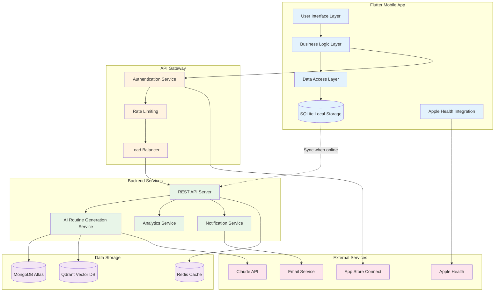
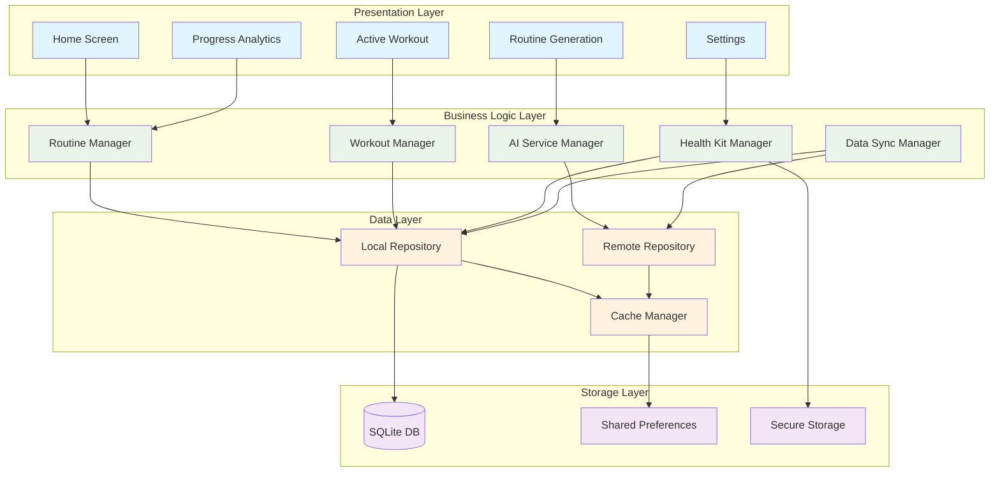
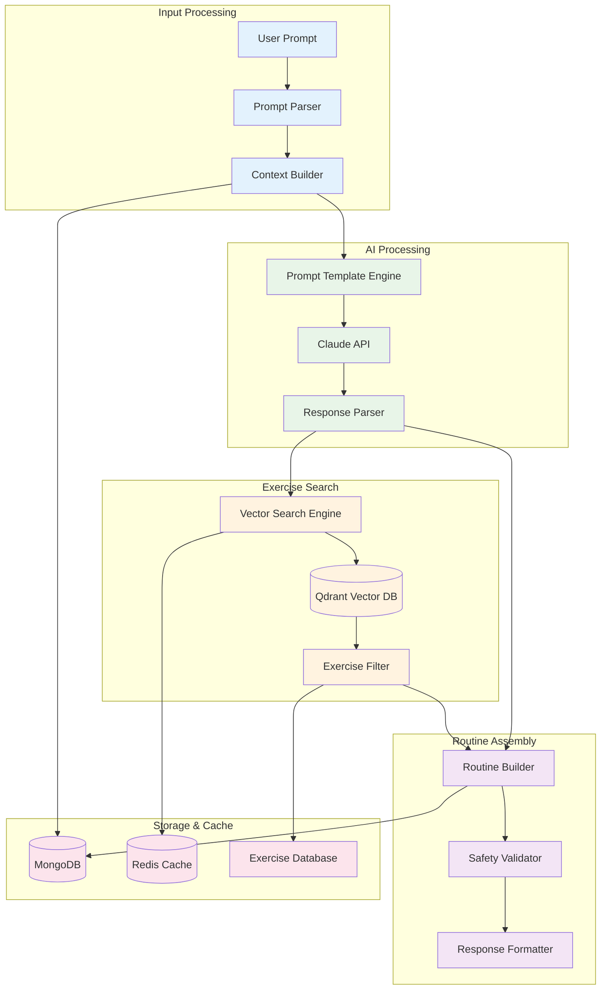
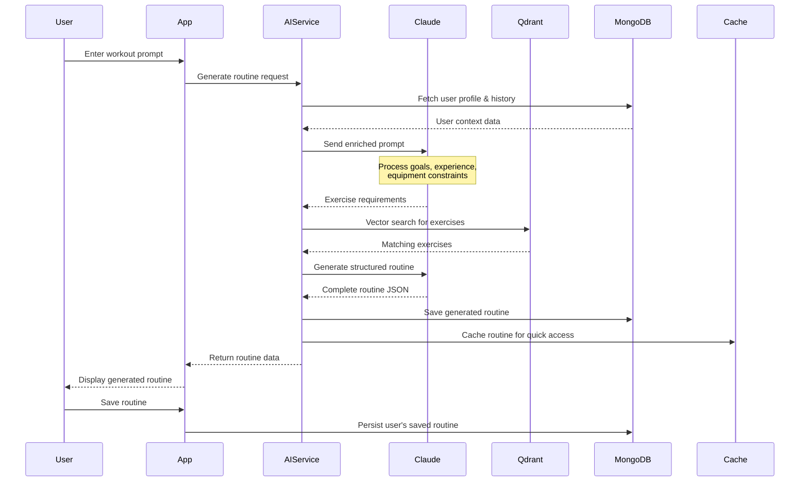
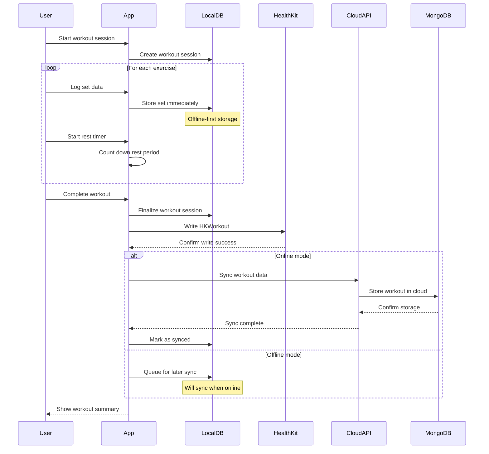
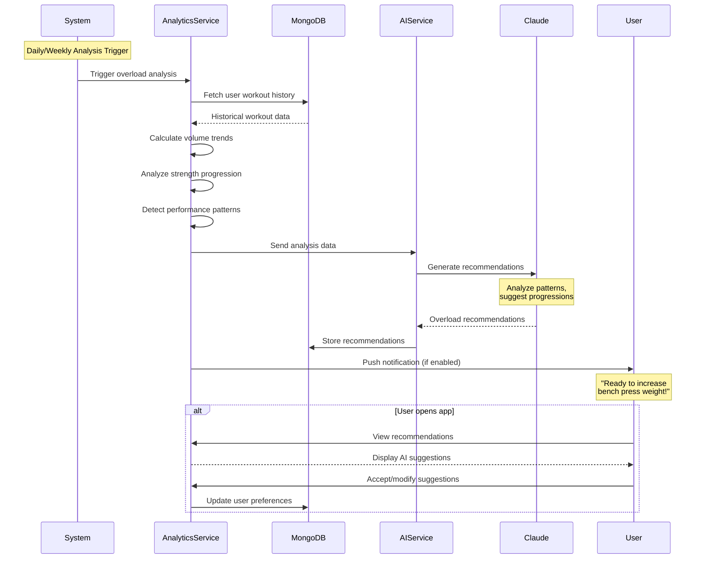
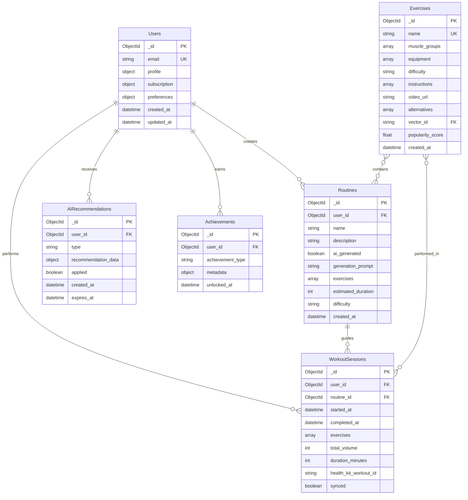
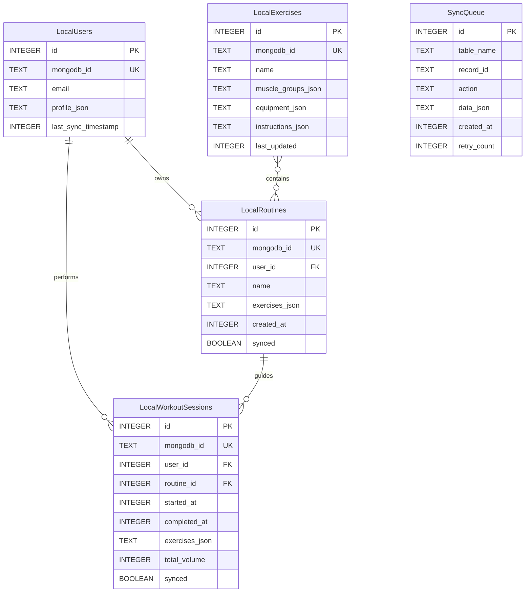
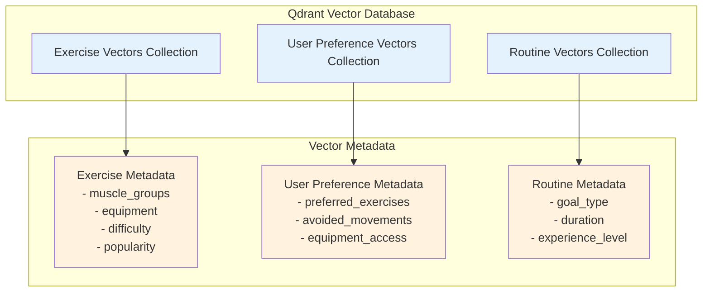

# SuperReps Technical Diagrams
*Architecture and User Flow Visualizations*

## Table of Contents

1. [System Architecture](#1-system-architecture)
2. [User Flow Diagrams](#2-user-flow-diagrams)
3. [Data Flow Diagrams](#3-data-flow-diagrams)
4. [Database Schema Relationships](#4-database-schema-relationships)

---

## 1. System Architecture

### 1.1 High-Level System Architecture



### 1.2 Mobile App Architecture



### 1.3 AI Service Architecture



---

## 2. User Flow Diagrams

### 2.1 AI Routine Generation Flow

```mermaid
flowchart TD
    Start([User Opens App]) --> CheckAuth{Authenticated?}
    CheckAuth -->|No| Login[Login/Register]
    CheckAuth -->|Yes| Home[Home Screen]
    Login --> Home
    
    Home --> Generate[Tap Generate Routine]
    Generate --> PromptScreen[Routine Generation Screen]
    
    PromptScreen --> InputMethod{Input Method}
    InputMethod -->|Voice| VoiceInput[Voice Input]
    InputMethod -->|Text| TextInput[Text Input]  
    InputMethod -->|Suggestions| ChipSelect[Select Suggestion Chip]
    
    VoiceInput --> ProcessPrompt[Process Prompt]
    TextInput --> ProcessPrompt
    ChipSelect --> ProcessPrompt
    
    ProcessPrompt --> ShowLoading[Show AI Generating...]
    ShowLoading --> AICall[Call AI Service]
    
    AICall --> Success{AI Success?}
    Success -->|No| ErrorScreen[Show Error + Retry]
    Success -->|Yes| ShowRoutine[Display Generated Routine]
    
    ErrorScreen --> PromptScreen
    
    ShowRoutine --> UserAction{User Action}
    UserAction -->|Save As-Is| SaveRoutine[Save Routine]
    UserAction -->|Modify| EditRoutine[Edit Routine Screen]
    UserAction -->|Regenerate| RegeneratePrompt[Modify Prompt]
    UserAction -->|Start Workout| StartWorkout[Begin Workout Session]
    
    EditRoutine --> SaveRoutine
    RegeneratePrompt --> ProcessPrompt
    SaveRoutine --> Home
    StartWorkout --> WorkoutSession[Active Workout]
    
    classDef start fill:#e8f5e8
    classDef process fill:#e3f2fd
    classDef decision fill:#fff3e0
    classDef end fill:#f3e5f5
    
    class Start,Home start
    class PromptScreen,ProcessPrompt,AICall,ShowRoutine,EditRoutine process
    class CheckAuth,InputMethod,Success,UserAction decision
    class SaveRoutine,StartWorkout,WorkoutSession end
```

### 2.2 Workout Logging Flow

```mermaid
flowchart TD
    Start([Start Workout]) --> SelectRoutine{Has Saved Routine?}
    SelectRoutine -->|Yes| ChooseRoutine[Select from Saved]
    SelectRoutine -->|No| CreateQuick[Quick Routine Creation]
    
    ChooseRoutine --> BeginWorkout[Begin Workout Session]
    CreateQuick --> BeginWorkout
    
    BeginWorkout --> WorkoutScreen[Active Workout Screen]
    WorkoutScreen --> ExerciseLoop{More Exercises?}
    
    ExerciseLoop -->|Yes| CurrentExercise[Current Exercise View]
    CurrentExercise --> SetEntry[Enter Set Data]
    
    SetEntry --> SetType{Set Type?}
    SetType -->|Warmup| WarmupSet[Log Warmup Set]
    SetType -->|Working| WorkingSet[Log Working Set]
    SetType -->|Drop| DropSet[Log Drop Set]
    SetType -->|Failure| FailureSet[Log Failure Set]
    
    WarmupSet --> RestTimer[Start Rest Timer]
    WorkingSet --> RestTimer
    DropSet --> RestTimer
    FailureSet --> RestTimer
    
    RestTimer --> MoreSets{More Sets?}
    MoreSets -->|Yes| SetEntry
    MoreSets -->|No| ExerciseComplete[Mark Exercise Complete]
    
    ExerciseComplete --> ExerciseLoop
    ExerciseLoop -->|No| WorkoutSummary[Workout Summary]
    
    WorkoutSummary --> UserChoice{User Action}
    UserChoice -->|Save & Sync| SaveWorkout[Save to Local DB]
    UserChoice -->|Discard| DiscardWorkout[Discard Session]
    UserChoice -->|Save Offline| SaveOffline[Save Local Only]
    
    SaveWorkout --> HealthSync[Sync to Apple Health]
    SaveOffline --> LocalSave[Store Locally]
    DiscardWorkout --> Home[Return to Home]
    
    HealthSync --> CloudSync{Online?}
    LocalSave --> CloudSync
    CloudSync -->|Yes| UploadData[Upload to Cloud]
    CloudSync -->|No| QueueSync[Queue for Later Sync]
    
    UploadData --> Home
    QueueSync --> Home
    
    classDef start fill:#e8f5e8
    classDef process fill:#e3f2fd
    classDef decision fill:#fff3e0
    classDef storage fill:#f3e5f5
    classDef end fill:#fce4ec
    
    class Start,BeginWorkout,CurrentExercise start
    class WorkoutScreen,SetEntry,RestTimer,WorkoutSummary process
    class SelectRoutine,ExerciseLoop,SetType,MoreSets,UserChoice,CloudSync decision
    class SaveWorkout,SaveOffline,LocalSave,UploadData,QueueSync storage
    class Home,DiscardWorkout end
```

### 2.3 User Onboarding Flow

```mermaid
flowchart TD
    AppLaunch([App First Launch]) --> Welcome[Welcome Screen]
    Welcome --> CreateAccount[Create Account]
    
    CreateAccount --> AuthMethod{Auth Method}
    AuthMethod -->|Email| EmailSignup[Email Registration]
    AuthMethod -->|Apple| AppleSignIn[Sign in with Apple]
    AuthMethod -->|Google| GoogleSignIn[Sign in with Google]
    
    EmailSignup --> ProfileSetup[Profile Setup]
    AppleSignIn --> ProfileSetup
    GoogleSignIn --> ProfileSetup
    
    ProfileSetup --> ExperienceLevel[Select Experience Level]
    ExperienceLevel --> Goals[Select Primary Goals]
    Goals --> Equipment[Available Equipment]
    Equipment --> Schedule[Workout Schedule Preferences]
    
    Schedule --> HealthPermission[Request Health Permissions]
    HealthPermission --> GrantHealth{Grant Permissions?}
    
    GrantHealth -->|Yes| HealthSetup[Setup Health Integration]
    GrantHealth -->|No| SkipHealth[Skip Health Setup]
    
    HealthSetup --> FirstPrompt[Generate First Routine]
    SkipHealth --> FirstPrompt
    
    FirstPrompt --> PromptSuggestions[Show Prompt Suggestions]
    PromptSuggestions --> SelectPrompt[User Selects Prompt]
    SelectPrompt --> GenerateDemo[Generate Demo Routine]
    
    GenerateDemo --> ShowResult[Show Generated Routine]
    ShowResult --> OnboardingComplete[Onboarding Complete]
    OnboardingComplete --> MainApp[Enter Main App]
    
    classDef start fill:#e8f5e8
    classDef auth fill:#e3f2fd
    classDef setup fill:#fff3e0
    classDef demo fill:#f3e5f5
    classDef end fill:#fce4ec
    
    class AppLaunch,Welcome start
    class CreateAccount,EmailSignup,AppleSignIn,GoogleSignIn auth
    class ProfileSetup,ExperienceLevel,Goals,Equipment,Schedule,HealthSetup setup
    class FirstPrompt,GenerateDemo,ShowResult demo
    class OnboardingComplete,MainApp end
```

---

## 3. Data Flow Diagrams

### 3.1 AI Routine Generation Data Flow



### 3.2 Workout Logging Data Flow



### 3.3 Progressive Overload Analysis Data Flow



---

## 4. Database Schema Relationships

### 4.1 MongoDB Collections Relationship



### 4.2 Local SQLite Schema



### 4.3 Qdrant Vector Collections



---

## Implementation Notes

### Performance Considerations
- **Vector Search**: Qdrant indexes optimized for sub-100ms exercise matching
- **Caching Strategy**: Redis caches frequent AI responses and user preferences
- **Database Indexing**: MongoDB compound indexes on user_id + created_at for fast queries
- **Offline Sync**: SQLite WAL mode for concurrent read/write operations

### Security Considerations  
- **API Authentication**: JWT tokens with 24-hour expiration
- **Data Encryption**: AES-256 encryption for sensitive local storage
- **Health Data**: Separate encrypted keychain storage for health permissions
- **Vector Security**: Qdrant API keys rotated monthly

### Monitoring & Observability
- **Performance Metrics**: AI generation time, database query performance
- **Error Tracking**: Comprehensive logging for AI failures and sync issues  
- **User Analytics**: Funnel tracking for onboarding and feature adoption
- **Health Monitoring**: Automated alerts for service degradation

*These diagrams provide the technical foundation for SuperReps implementation and should be referenced throughout development.*