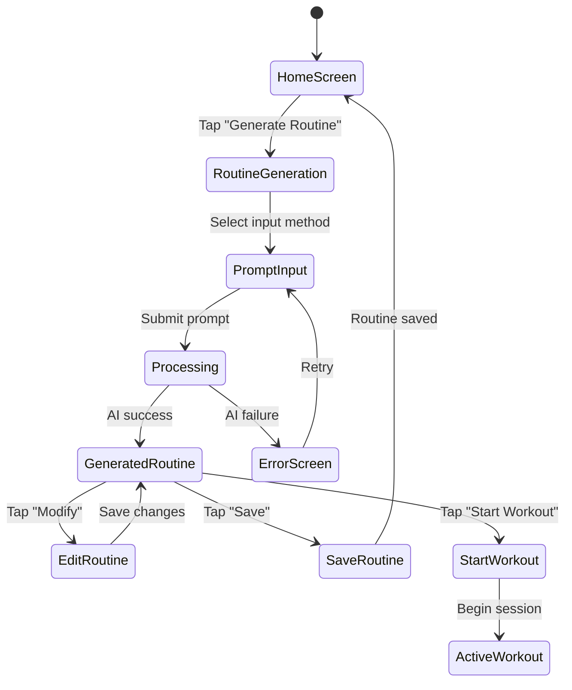

# SuperReps User Flow Wireframes
*AI Routine Generation Process Design*

## Table of Contents

1. [Design Principles](#1-design-principles)
2. [AI Routine Generation Flow](#2-ai-routine-generation-flow)
3. [Screen Wireframes](#3-screen-wireframes)
4. [Interactive States](#4-interactive-states)
5. [Error Handling](#5-error-handling)
6. [Accessibility Considerations](#6-accessibility-considerations)

---

## 1. Design Principles

### Mobile-First Approach
- **Touch-Friendly**: Minimum 44px touch targets (Apple guidelines)
- **Thumb Navigation**: Key actions within thumb reach zone
- **One-Handed Use**: Primary interactions accessible with single thumb
- **Progressive Disclosure**: Show relevant information step-by-step

### AI-First Philosophy
- **Prompt-First**: Lead with AI input, manual creation as secondary option
- **Streaming Feedback**: Real-time generation progress
- **Intelligent Suggestions**: Contextual prompt chips based on user profile
- **Effortless Refinement**: Easy editing of AI-generated routines

### Visual Hierarchy
- **Primary Action**: AI prompt input (largest, most prominent)
- **Secondary Actions**: Manual creation, saved routines
- **Tertiary Information**: Tips, suggestions, settings
- **Clear Affordances**: Buttons look like buttons, inputs look like inputs

---

## 2. AI Routine Generation Flow

### User Journey Overview



### Key Decision Points
1. **Input Method Selection**: Voice, text, or suggestion chips
2. **Generation Success**: AI routine vs. error handling
3. **User Satisfaction**: Save as-is, modify, or regenerate
4. **Next Action**: Start workout immediately or save for later

---

## 3. Screen Wireframes

### 3.1 Home Screen - Routine Generation Entry

```
┌─────────────────────────────────────────┐
│  ←  SuperReps                    ⚙️ 👤  │
├─────────────────────────────────────────┤
│                                         │
│  Welcome back, Alex! 👋                 │
│  Ready for your next workout?           │
│                                         │
│  ┌─────────────────────────────────────┐ │
│  │  🤖 Generate AI Routine             │ │  ← Primary CTA
│  │  Create workout from chat prompt    │ │     (Large, prominent)
│  └─────────────────────────────────────┘ │
│                                         │
│  ┌─────────────────────────────────────┐ │
│  │  📋 My Saved Routines               │ │  ← Secondary action
│  │  View and start saved workouts     │ │
│  └─────────────────────────────────────┘ │
│                                         │
│  ┌─────────────────────────────────────┐ │
│  │  ➕ Create Manual Routine           │ │  ← Tertiary action
│  │  Build routine exercise by exercise │ │
│  └─────────────────────────────────────┘ │
│                                         │
│  Recent Workouts                        │
│  • Chest & Triceps (2 days ago)       │
│  • Pull Day (4 days ago)              │
│                                         │
└─────────────────────────────────────────┘
```

**Key Elements:**
- **Prominent AI Button**: Largest touch target, clear AI branding
- **Visual Hierarchy**: Size and positioning emphasize AI-first approach
- **Quick Access**: Recent workouts for immediate continuation
- **Welcoming Tone**: Personalized greeting to create engagement

### 3.2 AI Routine Generation - Input Selection

```
┌─────────────────────────────────────────┐
│  ←  Generate AI Routine                 │
├─────────────────────────────────────────┤
│                                         │
│  🤖 Tell me what you want to work on    │
│                                         │
│  ┌─────────────────────────────────────┐ │
│  │  💬 Type your request...            │ │  ← Text input
│  │  ┌─────────────────────────────────┐ │ │
│  │  │                                 │ │ │
│  │  └─────────────────────────────────┘ │ │
│  │                🎤                   │ │  ← Voice input button
│  └─────────────────────────────────────┘ │
│                                         │
│  💡 Popular suggestions:                │
│                                         │
│  ┌──────────────┐ ┌──────────────────┐  │  ← Suggestion chips
│  │ Upper Body   │ │ Beginner Full    │  │
│  │ Strength     │ │ Body Routine     │  │
│  └──────────────┘ └──────────────────┘  │
│                                         │
│  ┌──────────────┐ ┌──────────────────┐  │
│  │ Quick 30min  │ │ Leg Day          │  │
│  │ HIIT         │ │ Hypertrophy      │  │
│  └──────────────┘ └──────────────────┘  │
│                                         │
│  ┌──────────────┐ ┌──────────────────┐  │
│  │ Push Day     │ │ Home Workout     │  │
│  │ Compound     │ │ No Equipment     │  │
│  └──────────────┘ └──────────────────┘  │
│                                         │
│  ⚙️ Advanced options                    │  ← Collapsible settings
│                                         │
└─────────────────────────────────────────┘
```

**Key Elements:**
- **Multi-Modal Input**: Text, voice, and suggestion chips
- **Smart Suggestions**: Based on user profile and popular workouts
- **Contextual Chips**: Personalized to user's experience level
- **Advanced Options**: Expandable section for time/equipment constraints

### 3.3 Advanced Options (Expanded)

```
┌─────────────────────────────────────────┐
│  ←  Generate AI Routine                 │
├─────────────────────────────────────────┤
│                                         │
│  ⚙️ Advanced Options                    │
│                                         │
│  Workout Duration                       │
│  ┌──────┐ ┌──────┐ ┌──────┐ ┌──────┐    │
│  │ 30m  │ │ 45m  │ │ 60m  │ │ 90m  │    │  ← Duration chips
│  └──────┘ └──────┘ └──────┘ └──────┘    │
│                                         │
│  Available Equipment ✓                  │
│  ☑️ Barbell      ☑️ Dumbbells          │  ← Equipment checkboxes
│  ☑️ Cables       ☑️ Machines           │     (based on profile)
│  ☐ Kettlebells   ☐ Resistance Bands    │
│                                         │
│  Experience Level                       │
│  ┌──────────────────────────────────────┐ │
│  │ ○ Beginner  ●Intermediate ○Advanced │ │  ← Radio buttons
│  └──────────────────────────────────────┘ │
│                                         │
│  Workout Focus                          │
│  ┌──────────────────────────────────────┐ │
│  │ ○ Strength  ●Hypertrophy  ○Endur.  │ │
│  └──────────────────────────────────────┘ │
│                                         │
│  ┌─────────────────────────────────────┐ │
│  │          Apply Settings            │ │  ← Apply button
│  └─────────────────────────────────────┘ │
│                                         │
└─────────────────────────────────────────┘
```

**Key Elements:**
- **Pre-filled Defaults**: Based on user profile data
- **Visual Selection**: Chips and checkboxes for quick selection
- **Smart Constraints**: Equipment list matches user's gym access
- **Context Preservation**: Settings apply to current generation only

### 3.4 AI Generation - Processing State

```
┌─────────────────────────────────────────┐
│  ←  Generating Your Routine             │
├─────────────────────────────────────────┤
│                                         │
│           🤖 AI Working...              │
│                                         │
│  ┌─────────────────────────────────────┐ │
│  │  ████████░░░░░░░░░░░░░░░░░░░░░░░░░░  │ │  ← Progress bar
│  │  Analyzing your goals... 65%        │ │
│  └─────────────────────────────────────┘ │
│                                         │
│  Your Request:                          │
│  "Upper body strength workout with      │
│  barbell and dumbbells, 60 minutes"    │
│                                         │
│  🎯 Matching exercises to your goals... │  ← Status updates
│                                         │
│  ✅ Found 12 suitable exercises         │
│  🏗️ Building optimal routine structure  │
│  📊 Calculating sets and reps...        │
│                                         │
│  ┌─────────────────────────────────────┐ │
│  │            Cancel                   │ │  ← Cancel option
│  └─────────────────────────────────────┘ │
│                                         │
│  💡 Tip: AI considers your experience   │
│     level and recent workouts          │
│                                         │
└─────────────────────────────────────────┘
```

**Key Elements:**
- **Progress Indicators**: Progress bar and step-by-step updates
- **Request Echo**: Shows what AI is processing for transparency
- **Real-time Updates**: Streaming status messages from backend
- **Cancel Option**: User can abort long-running generation
- **Educational Tips**: Explain AI capabilities while waiting

### 3.5 Generated Routine - Success State

```
┌─────────────────────────────────────────┐
│  ←  AI Upper Body Strength 💪           │
├─────────────────────────────────────────┤
│                                         │
│  ✨ Your routine is ready! (4.2s)       │
│  📊 6 exercises • ~62 min • Strength    │
│                                         │
│  ┌─────────────────────────────────────┐ │
│  │  🏋️ Barbell Bench Press             │ │  ← Exercise cards
│  │  4 sets × 5-6 reps • 3min rest     │ │
│  │  💡 Focus on controlled eccentric   │ │
│  └─────────────────────────────────────┘ │
│                                         │
│  ┌─────────────────────────────────────┐ │
│  │  🏋️ Incline Dumbbell Press          │ │
│  │  3 sets × 8-10 reps • 2min rest    │ │
│  │  💡 45° incline, full ROM           │ │
│  └─────────────────────────────────────┘ │
│                                         │
│  ┌─────────────────────────────────────┐ │
│  │  🏋️ Barbell Rows                    │ │
│  │  4 sets × 6-8 reps • 2.5min rest   │ │
│  │  💡 Pull to lower chest             │ │
│  └─────────────────────────────────────┘ │
│                                         │
│  ⋮ +3 more exercises                    │  ← Collapsed view
│                                         │
│  ┌───────────────┐ ┌─────────────────┐  │
│  │  🚀 Start     │ │  💾 Save        │  │  ← Primary actions
│  │   Workout     │ │   Routine       │  │
│  └───────────────┘ └─────────────────┘  │
│                                         │
│  ┌─────────────────────────────────────┐ │
│  │  ✏️ Modify Routine                  │ │  ← Secondary action
│  └─────────────────────────────────────┘ │
│                                         │
│  🔄 Not quite right? Generate again     │  ← Regenerate option
│                                         │
└─────────────────────────────────────────┘
```

**Key Elements:**
- **Success Celebration**: Positive messaging with generation time
- **Routine Summary**: Key metrics at top (exercises, duration, focus)
- **Exercise Cards**: Clear hierarchy with sets, reps, rest, and tips
- **Action Hierarchy**: Start workout most prominent, then save
- **Easy Iteration**: Clear options to modify or regenerate

### 3.6 Exercise Card - Expanded View

```
┌─────────────────────────────────────────┐
│  🏋️ Barbell Bench Press                 │
├─────────────────────────────────────────┤
│                                         │
│  📊 4 sets × 5-6 reps • 3min rest      │
│                                         │
│  🎯 Primary: Chest                      │
│  💪 Secondary: Triceps, Front Delts     │
│                                         │
│  📝 Form Cues:                          │
│  • Retract shoulder blades             │
│  • Drive feet into ground              │
│  • Control the eccentric               │
│                                         │
│  ┌─────────────────────────────────────┐ │
│  │  ▶️ Watch Video (0:45)              │ │  ← Video tutorial
│  └─────────────────────────────────────┘ │
│                                         │
│  🔄 Alternatives:                       │
│  • Dumbbell Bench Press                │
│  • Machine Chest Press                 │
│                                         │
│  ┌─────────────────────────────────────┐ │
│  │  ✏️ Edit Sets/Reps                  │ │  ← Edit options
│  └─────────────────────────────────────┘ │
│                                         │
│  ┌─────────────────────────────────────┐ │
│  │  🔄 Replace Exercise                │ │
│  └─────────────────────────────────────┘ │
│                                         │
└─────────────────────────────────────────┘
```

**Key Elements:**
- **Comprehensive Details**: Muscle groups, form cues, alternatives
- **Video Integration**: Easy access to exercise demonstrations
- **Modification Options**: Edit parameters or replace entirely
- **Educational Content**: Help users learn proper form

### 3.7 Routine Modification - Edit Mode

```
┌─────────────────────────────────────────┐
│  ←  Edit Routine                   ✓    │
├─────────────────────────────────────────┤
│                                         │
│  Routine Name:                          │
│  ┌─────────────────────────────────────┐ │
│  │  AI Upper Body Strength             │ │  ← Editable name
│  └─────────────────────────────────────┘ │
│                                         │
│  Reorder exercises by dragging ≡        │
│                                         │
│  ┌─────────────────────────────────────┐ │
│  │ ≡ 🏋️ Barbell Bench Press        ✏️  │ │  ← Drag handle + edit
│  │   4×5-6, 3min rest                 │ │
│  └─────────────────────────────────────┘ │
│                                         │
│  ┌─────────────────────────────────────┐ │
│  │ ≡ 🏋️ Incline Dumbbell Press     ✏️  │ │
│  │   3×8-10, 2min rest                │ │
│  └─────────────────────────────────────┘ │
│                                         │
│  ┌─────────────────────────────────────┐ │
│  │ ≡ 🏋️ Barbell Rows              ✏️  │ │
│  │   4×6-8, 2.5min rest              │ │
│  └─────────────────────────────────────┘ │
│                                         │
│  ┌─────────────────────────────────────┐ │
│  │  ➕ Add Exercise                     │ │  ← Add new exercise
│  └─────────────────────────────────────┘ │
│                                         │
│  ┌─────────────────────────────────────┐ │
│  │  💾 Save Changes                    │ │  ← Save button
│  └─────────────────────────────────────┘ │
│                                         │
└─────────────────────────────────────────┘
```

**Key Elements:**
- **Drag & Drop**: Intuitive reordering with visual handles
- **Inline Editing**: Quick access to modify each exercise
- **Add Exercises**: Easy way to enhance AI-generated routine
- **Clear Actions**: Prominent save button with visual confirmation

---

## 4. Interactive States

### 4.1 Input States

#### Text Input - Focus State
```
┌─────────────────────────────────────────┐
│  💬 Type your request...                │
│  ┌─────────────────────────────────────┐ │
│  │ chest and triceps workout|          │ │  ← Cursor visible
│  └─────────────────────────────────────┘ │
│  🎤                               📤    │  ← Send button active
└─────────────────────────────────────────┘
```

#### Voice Input - Recording State
```
┌─────────────────────────────────────────┐
│  💬 Listening... Tap to stop           │
│  ┌─────────────────────────────────────┐ │
│  │         🔴 Recording                │ │  ← Recording indicator
│  │    ▌▌▌▌▍▌▌▌▌▌▌▌▌▍▌▌▌▌             │ │  ← Audio waveform
│  └─────────────────────────────────────┘ │
│  ⏹️                               ❌    │  ← Stop/Cancel buttons
└─────────────────────────────────────────┘
```

### 4.2 Loading States

#### Initial Loading
```
┌─────────────────────────────────────────┐
│           🤖 Starting AI...             │
│  ┌─────────────────────────────────────┐ │
│  │  ░░░░░░░░░░░░░░░░░░░░░░░░░░░░░░░░░░  │ │  ← Indeterminate
│  └─────────────────────────────────────┘ │
└─────────────────────────────────────────┘
```

#### Progress Updates
```
┌─────────────────────────────────────────┐
│        🔍 Finding exercises...          │
│  ┌─────────────────────────────────────┐ │
│  │  ████████████░░░░░░░░░░░░░░░░░░░░░░  │ │  ← 60% complete
│  └─────────────────────────────────────┘ │
└─────────────────────────────────────────┘
```

### 4.3 Success States

#### Generation Complete
```
┌─────────────────────────────────────────┐
│  ✨ Routine generated in 4.2 seconds!   │
│  [Generated routine content...]         │
└─────────────────────────────────────────┘
```

#### Save Confirmation
```
┌─────────────────────────────────────────┐
│  ✅ Routine saved to your library!      │
│  [Routine content with "Saved" badge]   │
└─────────────────────────────────────────┘
```

### 4.4 Selection States

#### Suggestion Chip - Active
```
┌──────────────┐
│ Upper Body   │  ← Blue background, white text
│ Strength     │
└──────────────┘
```

#### Suggestion Chip - Inactive
```
┌──────────────┐
│ Upper Body   │  ← Light gray background, dark text
│ Strength     │
└──────────────┘
```

---

## 5. Error Handling

### 5.1 AI Generation Failed

```
┌─────────────────────────────────────────┐
│  ←  Generate AI Routine                 │
├─────────────────────────────────────────┤
│                                         │
│            😔 Oops!                     │
│                                         │
│  We couldn't generate your routine      │
│  right now. Our AI is experiencing      │
│  high demand.                           │
│                                         │
│  ┌─────────────────────────────────────┐ │
│  │  🔄 Try Again                       │ │  ← Primary action
│  └─────────────────────────────────────┘ │
│                                         │
│  ┌─────────────────────────────────────┐ │
│  │  📋 Browse Templates Instead        │ │  ← Alternative action
│  └─────────────────────────────────────┘ │
│                                         │
│  ┌─────────────────────────────────────┐ │
│  │  ➕ Create Manual Routine           │ │  ← Fallback option
│  └─────────────────────────────────────┘ │
│                                         │
│  💡 Tip: Try a simpler prompt like      │
│     "upper body workout"               │
│                                         │
└─────────────────────────────────────────┘
```

### 5.2 Network Error

```
┌─────────────────────────────────────────┐
│  ←  Generate AI Routine                 │
├─────────────────────────────────────────┤
│                                         │
│            📶 No Connection             │
│                                         │
│  AI routine generation requires an      │
│  internet connection.                   │
│                                         │
│  ┌─────────────────────────────────────┐ │
│  │  🔄 Retry                           │ │  ← Retry button
│  └─────────────────────────────────────┘ │
│                                         │
│  Meanwhile, you can:                    │
│                                         │
│  ┌─────────────────────────────────────┐ │
│  │  📋 Use Saved Routines              │ │  ← Offline alternatives
│  └─────────────────────────────────────┘ │
│                                         │
│  ┌─────────────────────────────────────┐ │
│  │  🏋️ Start Quick Workout             │ │
│  └─────────────────────────────────────┘ │
│                                         │
└─────────────────────────────────────────┘
```

### 5.3 Rate Limit Exceeded

```
┌─────────────────────────────────────────┐
│  ←  Generate AI Routine                 │
├─────────────────────────────────────────┤
│                                         │
│            ⏱️ Slow down there!          │
│                                         │
│  You've reached your AI generation      │
│  limit for this hour (25/25 used).     │
│                                         │
│  ⏰ Next generation available in 42min  │
│                                         │
│  ┌─────────────────────────────────────┐ │
│  │  ⭐ Upgrade to Pro                  │ │  ← Upgrade CTA
│  │  Unlimited AI generations          │ │
│  └─────────────────────────────────────┘ │
│                                         │
│  ┌─────────────────────────────────────┐ │
│  │  📋 Use Saved Routines              │ │  ← Alternatives
│  └─────────────────────────────────────┘ │
│                                         │
│  ┌─────────────────────────────────────┐ │
│  │  ➕ Create Manual Routine           │ │
│  └─────────────────────────────────────┘ │
│                                         │
└─────────────────────────────────────────┘
```

### 5.4 Invalid Prompt

```
┌─────────────────────────────────────────┐
│  ←  Generate AI Routine                 │
├─────────────────────────────────────────┤
│                                         │
│  💬 Type your request...                │
│  ┌─────────────────────────────────────┐ │
│  │ abc123 !@# random text              │ │  ← Invalid input
│  └─────────────────────────────────────┘ │
│                                         │
│  ❗ We couldn't understand that request │
│                                         │
│  💡 Try something like:                 │
│  • "chest and back workout"            │
│  • "beginner full body routine"        │
│  • "30 minute HIIT session"           │
│                                         │
│  ┌─────────────────────────────────────┐ │
│  │  🔄 Try Different Prompt            │ │
│  └─────────────────────────────────────┘ │
│                                         │
└─────────────────────────────────────────┘
```

---

## 6. Accessibility Considerations

### 6.1 Visual Accessibility

#### High Contrast Support
- **Color Contrast**: Minimum 4.5:1 ratio for normal text, 3:1 for large text
- **Focus Indicators**: Clear 2px blue border on focused elements
- **Color Independence**: Never rely solely on color to convey information
- **Dark Mode**: Full support with appropriate color inversions

#### Typography
- **Font Sizes**: Minimum 16px for body text, 20px for buttons
- **Line Spacing**: 1.4x line height for improved readability
- **Font Weight**: Medium (500) or bold (600) for important text
- **Dynamic Type**: Support iOS Dynamic Type scaling

### 6.2 Motor Accessibility

#### Touch Targets
- **Minimum Size**: 44×44px touch targets (Apple guidelines)
- **Spacing**: 8px minimum between touch targets
- **Gesture Alternatives**: Drag actions have button alternatives
- **One-Handed Use**: Critical actions within thumb reach zone

#### Input Methods
- **Voice Input**: Alternative to typing for motor impairments
- **Switch Control**: Full navigation support via iOS Switch Control
- **AssistiveTouch**: Compatible with iOS AssistiveTouch features

### 6.3 Cognitive Accessibility

#### Clear Communication
- **Simple Language**: Plain language, avoid fitness jargon
- **Progressive Disclosure**: Show information step-by-step
- **Clear Actions**: Button labels clearly describe what happens
- **Consistent Patterns**: Similar actions work the same way

#### Error Prevention
- **Input Validation**: Real-time feedback for invalid inputs
- **Confirmation Steps**: Confirm destructive actions (delete routine)
- **Undo Options**: Easy way to reverse accidental actions
- **Helpful Errors**: Error messages explain how to fix the problem

### 6.4 Screen Reader Support

#### VoiceOver Labels
```swift
// Example iOS VoiceOver implementation
Button("Generate Routine") {
    // Action
}
.accessibilityLabel("Generate AI workout routine")
.accessibilityHint("Creates a personalized workout based on your goals")
```

#### Semantic Structure
- **Headings**: Proper heading hierarchy (h1, h2, h3)
- **Labels**: All form inputs have associated labels
- **Descriptions**: Complex UI elements have descriptions
- **Live Regions**: Dynamic content updates announced to screen reader

#### Navigation Support
- **Focus Management**: Focus moves logically through the interface
- **Skip Links**: Quick navigation to main content areas
- **Landmark Roles**: Clear sections (navigation, main, complementary)
- **Tab Order**: Logical tab sequence for keyboard navigation

### 6.5 Reduced Motion Support

#### Animation Preferences
- **Respect Settings**: Honor iOS "Reduce Motion" accessibility setting
- **Essential Motion**: Only animate when necessary for understanding
- **Alternative Feedback**: Provide non-motion feedback options
- **Immediate Updates**: Option to disable loading animations

#### Loading States
```swift
// Reduced motion loading state
if !UIAccessibility.isReduceMotionEnabled {
    // Show animated progress bar
} else {
    // Show static progress indicator with text updates
}
```

---

## Implementation Guidelines

### Performance Considerations
- **Smooth Scrolling**: 60fps scrolling with optimized list rendering
- **Quick Response**: Button presses provide immediate visual feedback
- **Lazy Loading**: Exercise details loaded on demand
- **Image Optimization**: Compressed exercise photos with placeholder loading

### Platform Guidelines
- **iOS Human Interface Guidelines**: Follow Apple's design principles
- **Material Design**: Android version follows Material Design 3
- **Native Components**: Use platform-native UI components where possible
- **Platform Conventions**: Respect each platform's interaction patterns

### Testing Strategy
- **Usability Testing**: Test with target users (gym beginners to intermediates)
- **Accessibility Testing**: Test with screen readers and assistive technologies
- **Performance Testing**: Ensure smooth performance on older devices
- **A/B Testing**: Test different layouts and interaction patterns

### Future Enhancements
- **Voice-Only Flow**: Complete routine generation via voice commands
- **Smart Suggestions**: ML-powered prompt auto-completion
- **Visual Search**: Camera-based exercise identification and addition
- **Gesture Navigation**: Swipe-based navigation for power users

*These wireframes provide the foundation for implementing SuperReps' AI-first routine generation experience, prioritizing usability, accessibility, and the core value proposition of effortless AI-powered workout creation.*